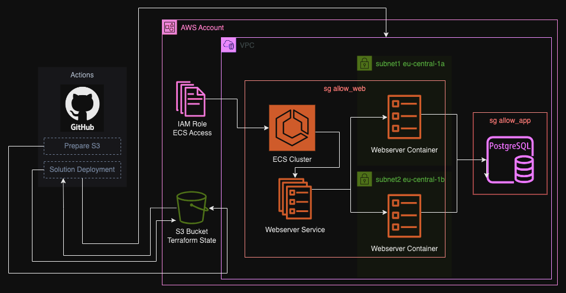

# challenge-cloud-deployment
This solution deploys a webserver as a container in AWS ECS using terraform.

## Requirements
- Valid AWS account
- AWS CLI
- Terraform
- GIT

## Architecture and resources
- S3 bucket - Used as a remote storage for terraform state file
- IAM - Role for ECS execution
- VPC - VPC, Subnets and Security Groups
- RDS - PostgreSQL Database
- ECS - Container Service

### Architecture overview


## Deployment Steps
- Prepare S3
    - Set up the connection to AWS by AWS CLI
    - Set up and execute terraform to plan and create the terraform state S3 bucket
- Solution Deployment
    - Set up the connection to AWS by AWS CLI
    - Set up and execute terraform to plan and create the resources in AWS

### How to run locally
- Clone this git repository
```
git clone {code_repo}
```
- Set your AWS keys
```
echo "[default]
aws_access_key_id = {your_aws_key_id}
aws_secret_access_key = {your_aws_secret_key}" > ~/.aws/credentials
echo "[default]
region = {aws_region}
output = json" > ~/.aws/config
```
- Go to the S3 folder and execute terraform
```
cd infra/s3
terraform init
terraform plan
terraform apply
cd -
```
- Go to the solution folder and execute terraform (variable values input required)
```
cd infra/solution
teraform init
terraform plan -var-file="terraform.tfvars"
terraform apply -var-file="terraform.tfvars"
```

## Design decisions
- Terraform state file stored remotely in S3 for best practices and security reasons
- ECS instead of EKS for the webserver to save time in the resources creation
- Subnets in different availability zones for high-availability